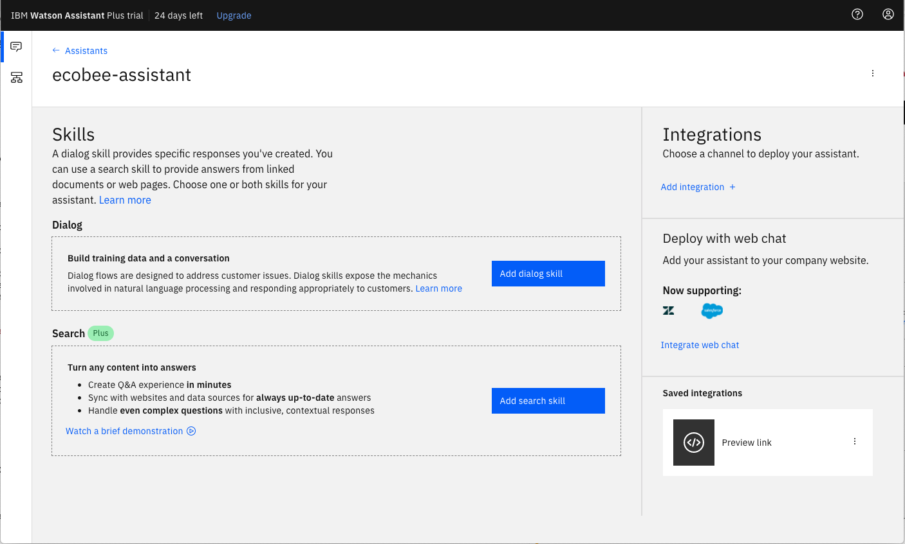
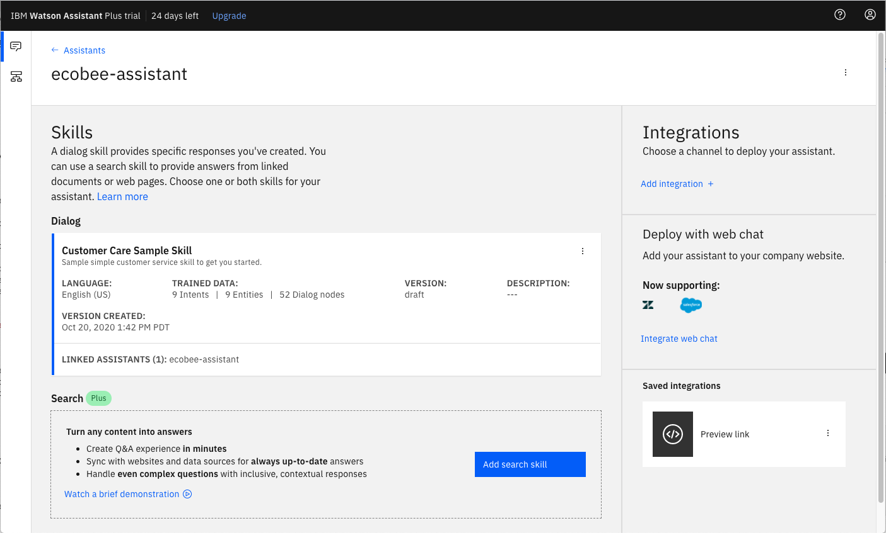

[](https://travis-ci.org/IBM/watson-discovery-sdu-with-assistant)

# Enhance customer helpdesks with Smart Document Understanding using Assistant Search Skill

In this code pattern, we walk you through a working example of a web app that utilizes multiple Watson services to create a better customer care experience.

Using the Watson Discovery Smart Document Understanding (SDU) feature, we will enhance the Discovery model so that queries will be better focused to only search the most relevant information found in a typical owner's manual.

Using Watson Assistant, we will use a standard customer care dialog to handle a typical conversation between a customer and a company representitive. When a customer question involves operation of a product, the Assistant dialog skill will communicate with the Discovery service using an Assistant search skill.

> **NOTE**: This code pattern includes instructions for accessing Watson services running on both IBM Cloud and on IBM Cloud Pak for Data. In setting up your app, the main difference is the additional credentials required to access the IBM Cloud Pak for Data cluster that is hosting your Watson services.
>
> Click [here](https://www.ibm.com/products/cloud-pak-for-data) for more information about IBM Cloud Pak for Data.

## What is SDU?

SDU trains Watson Discovery to extract custom fields in your documents. Customizing how your documents are indexed into Discovery will improve the answers returned from queries.

With SDU, you annotate fields within your documents to train custom conversion models. As you annotate, Watson is learning and will start predicting annotations. SDU models can also be exported and used on other collections.

Current document type support for SDU is based on your plan:

  * Lite plans: PDF, Word, PowerPoint, Excel, JSON, HTML
  * Advanced plans: PDF, Word, PowerPoint, Excel, PNG, TIFF, JPG, JSON, HTML

Here is a great video that provides an overview of the benefits of SDU, and a walk-through of how to apply it to your document:

[](https://www.youtube.com/watch?v=Jpr3wVH3FVA)

## What is an Assistant Search Skill?

An Assistant search skill is a mechanism that allows you to directly query a Watson Discovery collection from your Assistant dialog. A search skill is triggered when the dialog reaches a node that has a search skill enabled. The user query is then passed to the Watson Discovery collection via the search skill, and the results are returned to the dialog for display to the user.

Click [here](https://cloud.ibm.com/docs/services/assistant?topic=assistant-skill-search-add) for more information about the Watson Assistant search skill.

> **NOTE**: Another method of integrating Watson Assistant with Watson Discovery is through the use of a webhook, which can be created using IBM Cloud Functions. Click [here](https://github.com/IBM/watson-discovery-sdu-with-assistant) to view a code pattern that uses this technique.

## Flow


1. The document is annotated using Watson Discovery SDU
1. The user interacts with the backend server via the app UI. The frontend app UI is a chatbot that engages the user in a conversation.
1. Dialog between the user and backend server is coordinated using a Watson Assistant dialog skill.
1. If the user asks a product operation question, a search query is issued to the Watson Discovery service via a Watson Assistant search skill.

# Watch the Video

[](https://youtu.be/-yniuX-Poyw)

>**NOTE**: This video is using `V1` versions of both Watson Discovery and Assistant. The concepts are similar in `V2`, but the navigation steps may be different.

# Steps:

1. [Clone the repo](#1-clone-the-repo)
1. [Create Watson services](#2-create-watson-services)
1. [Configure Watson Discovery](#3-configure-watson-discovery)
1. [Configure Watson Assistant](#4-configure-watson-assistant)
1. [Add Watson service credentials to environment file](#5-add-watson-service-credentials-to-environment-file)
1. [Run the application](#6-run-the-application)

### 1. Clone the repo

```bash
git clone https://github.com/IBM/watson-assistant-with-search-skill
```

### 2. Create Watson services

Create the following services:

* **Watson Assistant**
* **Watson Discovery**

The instructions will depend on whether you are provisioning services using IBM Cloud Pak for Data or on IBM Cloud.

Click to expand one:

<details><summary><b>IBM Cloud Pak for Data</b></summary>
<p>
<i>Use the following instructions for each of the services.</i>
<p>
<h5>Install and provision service instances</h5>
<p>
The services are not available by default. An administrator must install them on the IBM Cloud Pak for Data platform, and you must be given access to the service. To determine whether the service is installed, Click the <b>Services</b> icon () and check whether the service is enabled.
</details>

<details><summary><b>IBM Cloud</b></summary>
<p>
<h5>Create the service instances</h5>
  <ul>
    <li>If you do not have an IBM Cloud account, register for a free trial account <a href="https://cloud.ibm.com/registration">here</a>.</li>
    <li>Create a <b>Assistant</b> instance from <a href="https://cloud.ibm.com/catalog/services/watson-assistant">the catalog</a>.</li>
    <li>Create a <b>Discovery</b> instance from <a href="https://cloud.ibm.com/catalog/services/discovery">the catalog</a> and select the default "Plus" plan.</li>
  </ul>

  >**NOTE**: The first instance of the `Plus` plan for IBM Watson Discovery comes with a free 30-day trial; it is chargeable once the trial is over. If you no longer require your Plus instance for Watson Discovery after going through this exercise, feel free to delete it.
</details>

### 3. Configure Watson Discovery

Start by launching your Watson Discovery instance. How you do this will depend on whether you provisioned the instance on IBM Cloud Pak for Data or on IBM Cloud.

Click to expand one:

<details><summary><b>IBM Cloud Pak for Data</b></summary>

Find the Discovery service in your list of `Provisioned Instances` in your IBM Cloud Pak for Data Dashboard.

Click on `View Details` from the options menu associated with your Discovery service.

  

Click on `Open Watson Discovery`.

  

</details>

<details><summary><b>IBM Cloud</b></summary>

From the IBM Cloud dashboard, click on your new Discovery service in the resource list.

  

From the `Manage` tab panel of your Discovery service, click the `Launch Watson Discovery` button.

</details>

### Create a project and collection

The landing page for Watson Discovery is a panel showing your current projects.

Create a new project by clicking the `New Project` tile.

> **NOTE**: The Watson Discovery service queries are defaulted to be performed on all collections within a project. For this reason, it is advised that you create a new project to contain the collection we will be creating for this code pattern.

  

Give the project a unique name and select the `Document Retrieval` option, then click `Next`.

  

For data source, click on the `Upload data` tile and click `Next`.

  

Enter a unique name for your collection and click `Finish`.

### Import the document

On the `Configure Collection` panel, click the `Drag and drop files here or upload` button to select and upload the `ecobee3_UserGuide.pdf` file located in the `data` directory of your local repo.

  

>**NOTE**: The `Ecobee` is a popular residential thermostat that has a wifi interface and multiple configuration options.

Once the file is loaded, click the `Finish` button.

Note that after the file is loaded it may take some time for Watson Discovery to process the file and make it available for use. You should see a notification once the file is ready.

### Access the collection

To access the collection, make sure you are in the correct project, then click the `Manage Collections` tab in the left-side of the panel.

  

Click the collection tile to access it.

  

Before applying Smart Document Understanding (SDU) to our document, lets do some simple queries on the data so that we can compare it to results found after applying SDU. Click the `Try it out` panel to bring up the query panel.

  

Enter queries related to the operation of the thermostat and view the results. As you will see, the results are not very useful, and in some cases, not even related to the question.

### Annotate with SDU

Now let's apply SDU to our document to see if we can generate some better query responses.

  

From the `Define structure` drop-down menu, click on `New fields`.

  

From the `Identify fields` tab panel, click on `User-trained models`, the click `Submit` from the confirmation dialog.

Click the `Apply changes and reprocess` button in the top right corner. This will SDU process.

Here is the layout of the SDU annotation panel:


The goal is to annotate all of the pages in the document so Discovery can learn what text is important, and what text can be ignored.

* [1] is the list of pages in the manual. As each is processed, a green check mark will appear on the page.
* [2] is the current page being annotated.
* [3] is a graphic display of the same page, but allows you to select regions that you can label.
* [4] is the list of labels you can assign to the graphic page.
* Click [5] to submit the page to Discovery.
* Click [6] when you have completed the annotation process.

To add/change a label, select the new label, then click on the text areas in the graphic page to apply it.

As you go though the annotations one page at a time, Discovery is learning and should start automatically updating the upcoming pages. Once you get to a page that is already correctly annotated, you can stop, or simply click `Submit` [5] to acknowledge it is correct. The more pages you annotate, the better the model will be trained.

For this specific owner's manual, at a minimum, it is suggested to mark the following:

* The main title page as `title`
* The table of contents (shown in the first few pages) as `table_of_contents`
* All headers and sub-headers (typed in light green text) as a `subtitle`
* All page numbers as `footers`
* All circuitry diagram pages (located near the end of the document) as a `footer`
* All licensing information (located in the last few pages) as a `footer`
* All other text should be marked as `text`.

Click the `Apply changes and reprocess` button [6] to load your changes. Wait for Discovery to notify you that the reprocessing is complete.

Next, click on the `Manage fields` [1] tab.


* [2] Here is where you tell Discovery which fields to ignore. Using the `on/off` buttons, turn off all labels except `subtitles` and `text`.
* [3] is telling Discovery to split the document apart, based on `subtitle`.
* Click [4] to submit your changes.

Return to the `Activity` tab. After the changes are processed (may take some time), your collection will look very different:


Return to the query panel (click `Try it out`) and see how much better the results are.


</details>

### 4. Configure Watson Assistant

The instructions for configuring Watson Assistant are basically the same for both IBM Cloud Pak for Data and IBM Cloud.

One difference is how you launch the Watson Assistant service. Click to expand one:

<details><summary><b>IBM Cloud Pak for Data</b></summary>

Find the Assistant service in your list of `Provisioned Instances` in your IBM Cloud Pak for Data Dashboard.

Click on `View Details` from the options menu associated with your Assistant service.

Click on `Open Watson Assistant`.

</details>

<details><summary><b>IBM Cloud</b></summary>

Find the Assistant service in your IBM Cloud Dashboard.

Click on the service and then click on Launch tool.

</details>

### Create assistant

From the main Assistant panel, you will see 2 tab options - `Assistants` and `Skills`. An `Assistant` is the container for a set of `Skills`.

Go to the Assistant tab and click `Create assistant`.

  

Give your assistant a unique name then click `Create assistant`.

### Create Assistant dialog skill

You will then be taken to a panel that shows the `Skills` assigned to your `Assistant`. You can also revisit this panel by selected the desired `Assistant` listed in the `Assistants` tab panl.

  

Click on `Add dialog skill`.

From the `Add Dialog Skill` panel, select the `Use sample skill` tab.

Select the `Customer Care Sample Skill` as your template.

The newly created dialog skill should now be shown in your Assistant panel:

  

Click on your newly created dialog skill to edit it.

#### Add new intent

The default customer care dialog does not have a way to deal with any questions involving outside resources, so we will need to add this.

Create a new `intent` that can detect when the user is asking about operating the Ecobee thermostat.

From the `Customer Care Sample Skill` panel, select the `Intents` tab.

Click the `Create intent` button.

Name the intent `#Product_Information`, and at a minimum, enter the following example questions to be associated with it.


#### Create new dialog node

Now we need to add a node to handle our intent. Click on the back arrow in the top left corner of the panel to return to the main panel. Click on the `Dialog` tab to bring up the nodes defined for the dialog.

Select the `What can I do` node, then click on the drop down menu and select the `Add node below` option.


Name the node "Ask about product" [1] and assign it our new intent [2].


In the `Assistant responds` dropdown, select the option `Search skill`.

This means that if Watson Assistant recognizes a user input such as "how do I set the time?", it will direct the conversation to this node, which will integrate with the search skill.

### Create Assistant search skill

Return to the Skills panel by clicking the `Skills` icon in the left menu pane.

From your Assistant skills panel, click on `Create skill`.

For `Skill Type`, select `Search skill` and click `Next`.

> **Note**: If you have provisioned Watson Assistant on IBM Cloud, the search skill is only offered on a paid plan, but a 30-day trial version is available if you click on the `Plus` button.

Give your search skill a unique name, then click `Continue`.

From the search skill panel, select the Discovery service instance and collection you created previously.


Click `Configure` to continue.

From the `Configure Search Response` panel, select `text` as the field to use for the `Body` of the response.


You can also customize the return `Message` to be more appropriate for your use case.

Click `Create` to complete the configuration.

Now when the dialog skill node invokes the search skill, the search skill will query the Discovery collection and display the text result to the user.

### Test in Assistant Tooling

> **NOTE**: The following feature is currently only available for Watson Assistant provisioned on IBM Cloud.

You should now see both skills have been added to your assistant.


Normally, you can test the dialog skill be selecting the `Try it` button located at the top right side of the dialog skill panel, but when integrated with a search skill, a different method of testing must be used.

From your assistant panel, select `Preview link`.


From the list of available integration types, select `Preview link`.

If you click on the generated URL link, you will be able to interact with your dialog skill. Note that the input "how do I turn on the heater?" has triggered our `Ask about product` dialog node and invoked our search skill.


### 5. Add Watson service credentials to environment file

Copy the local `env.sample` file and rename it `.env`:

```bash
cp env.sample .env
```

You will need to Update the `.env` file with the credentials from your Assistant service. First you will need the `Assistant ID` which can found by:

* Click on your Assistant panel
* Clicking on the three dots in the upper right-hand corner and select `Settings`.
* Select the `API Details` tab.

You will also need the credentials for your Assistant service. What credentials you will need will depend on if you provisioned Watson Assistant on IBM Cloud Pak for Data or on IBM Cloud. Click to expand one:

<details><summary><b>IBM Cloud Pak for Data</b></summary>

<h5>Gather service credentials</h5>
<p>
<ol>
    <li>For production use, create a user to use for authentication. From the main navigation menu (☰), select <b>Administer > Manage users</b> and then <b>+ New user</b>.</li>
    <li>From the main navigation menu (☰), select <b>My instances</b>.</li>
    <li>On the <b>Provisioned instances</b> tab, find your service instance, and then hover over the last column to find and click the ellipses icon. Choose <b>View details</b>.</li>
    <li>Copy the <b>URL</b> to use as the <b>{SERVICE_NAME}_URL</b> when you configure credentials.</li>
    <li><i>Optionally, copy the <b>Bearer token</b> to use in development testing only. It is not recommended to use the bearer token except during testing and development because that token does not expire.</i></li>
    <li>Use the <b>Menu</b> and select <b>Users</b> and <b>+ Add user</b> to grant your user access to this service instance. This is the user name (and password) you will use when you configure credentials to allow the Node.js server to authenticate.</li>
</ol>

Edit the `.env` file with the necessary credentials and settings.

#### `env.sample:`

```bash
# Copy this file to .env and replace the credentials with
# your own before starting the app.
​
#----------------------------------------------------------
# IBM Cloud Pak for Data (username and password)
#
# If your services are running on IBM Cloud Pak for Data,
# uncomment and configure these.
# Remove or comment out the IBM Cloud section.
#----------------------------------------------------------
​
ASSISTANT_AUTH_TYPE=cp4d
ASSISTANT_AUTH_URL=https://my-cpd-cluster.ibmcodetest.us
ASSISTANT_USERNAME=my-username
ASSISTANT_PASSWORD=my-password
ASSISTANT_URL=https://my-cpd-cluster.ibmcodetest.us/assistant/assistant/instances/1576274722862/api
# # If you use a self-signed certificate, you need to disable SSL verification.
# # This is not secure and not recommended.
## ASSISTANT_AUTH_DISABLE_SSL=true
## ASSISTANT_DISABLE_SSL=true
ASSISTANT_ID=<add_assistant_id>
```

</details>

<details><summary><b>IBM Cloud</b></summary>

For the Watson Assistant service provisioned on IBM Cloud, all of your credentials will be available on the `API Details` panel.


> **Important**: ASSISTANT_URL should end with an instance ID. If it contains `v2/assistants/<id>`, please delete this part of the URL. For example: "https://api.us-south.assistant.watson.cloud.ibm.com/instances/5db04c67/v2/assistants/a85f67e8-xxx/sessions" should be truncated to "https://api.us-south.assistant.watson.cloud.ibm.com/instances/5db04c67".

Edit the `.env` file with the necessary credentials and settings.

#### `env.sample:`

```bash
# Copy this file to .env and replace the credentials with
# your own before starting the app.

#----------------------------------------------------------
# IBM Cloud
#
# If your services are running on IBM Cloud,
# uncomment and configure these.
# Remove or comment out the IBM Cloud Pak for Data sections.
#----------------------------------------------------------

# Watson Assistant
ASSISTANT_AUTH_TYPE=iam
ASSISTANT_APIKEY=2ZzwqVghEhvLEvRxfxxxxxmLukVv3YIF411GvgXhHX
ASSISTANT_URL=https://api.us-south.assistant.watson.cloud.ibm.com/instances/5db04c67-b295-9999-bb99-e5587b6bed91
ASSISTANT_ID=25f892c4-e1e6-2222-b6c8-0b8660786d1f
```

</details>

### 6. Run the application

1. Install [Node.js](https://nodejs.org/en/) runtime or NPM.
1. Start the app by running `npm install`, followed by `npm start`.
1. Use the chatbot at `localhost:3000`.

Sample questions:

* **How do I override the scheduled temperature**
* **How do I turn on the heater**
* **how do I set a schedule?**

# Sample Output


# Access to results in application

* To view the raw JSON results returned from Discovery (via the Assistant search skill), open up the Development tools in your browser and view the console output. Here is sample of what you should see:

```json
{
"result": {
  "output": {
    "generic": [
      {
        "response_type": "search",
        "header": "I searched my knowledge base and found this information which might be useful:",
        "results": [
          {
            "title": null,
            "body": "You can override the scheduled temperature by moving the bubble on the temperature slider up or down. The blue number represents the cool set point; the orange number represents the heat set point. The new desired temperature will be the set point used for the Hold. The duration of the Hold is the last configured value (the default value is Until I change it, meaning it keeps the value indefinitely, until you choose to revert to the schedule or change it). You can adjust the default Hold time in the Preferences menu (page 21). To cancel the current Hold, touch the Hold message box displayed on the Home screen. You can touch the box anywhere and not just the X displayed on the box.",
            "url": null,
            "id": "3a5efee70d8cc9d70e2b94d22c15e2d1_24",
            "result_metadata": {
              "confidence": 0.3056213337457547,
              "score": 7.38697695
            },
            "highlight": {
              "text": [
                "You can override the <em>scheduled</em> temperature by moving the bubble on the temperature slider up or down. The blue number represents the cool <em>set</em> point; the orange number represents the heat <em>set</em> point. The new desired temperature will be the <em>set</em> point used for the Hold.",
                "The duration of the Hold is the last configured value (the default value is Until <em>I</em> change it, meaning it keeps the value indefinitely, until you choose to revert to the <em>schedule</em> or change it). You can adjust the default Hold time in the Preferences menu (page 21). To cancel the current Hold, touch the Hold message box displayed on the Home screen."
              ],
              "body": [
                "You can override the <em>scheduled</em> temperature by moving the bubble on the temperature slider up or down. The blue number represents the cool <em>set</em> point; the orange number represents the heat <em>set</em> point. The new desired temperature will be the <em>set</em> point used for the Hold.",
                "The duration of the Hold is the last configured value (the default value is Until <em>I</em> change it, meaning it keeps the value indefinitely, until you choose to revert to the <em>schedule</em> or change it). You can adjust the default Hold time in the Preferences menu (page 21). To cancel the current Hold, touch the Hold message box displayed on the Home screen."
              ]
            }
          },
```

# Learn more

* **Artificial Intelligence Code Patterns**: Enjoyed this Code Pattern? Check out our other [AI Code Patterns](https://developer.ibm.com/technologies/artificial-intelligence/)
* **AI and Data Code Pattern Playlist**: Bookmark our [playlist](https://www.youtube.com/playlist?list=PLzUbsvIyrNfknNewObx5N7uGZ5FKH0Fde) with all of our Code Pattern videos
* **With Watson**: Want to take your Watson app to the next level? Looking to utilize Watson Brand assets? [Join the With Watson program](https://www.ibm.com/watson/with-watson/) to leverage exclusive brand, marketing, and tech resources to amplify and accelerate your Watson embedded commercial solution.

# License

This code pattern is licensed under the Apache License, Version 2. Separate third-party code objects invoked within this code pattern are licensed by their respective providers pursuant to their own separate licenses. Contributions are subject to the [Developer Certificate of Origin, Version 1.1](https://developercertificate.org/) and the [Apache License, Version 2](https://www.apache.org/licenses/LICENSE-2.0.txt).

[Apache License FAQ](https://www.apache.org/foundation/license-faq.html#WhatDoesItMEAN)
